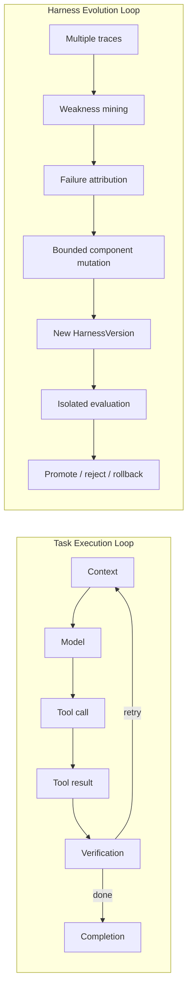

# Architecture

The runtime is organized as six ownership layers. None delegates the core agent loop to another
coding-agent harness.

| Layer | Owned responsibilities |
| --- | --- |
| Agent Runtime Kernel | provider abstraction, context, model/tool loop, sessions, skills, memory, subagents |
| Harness Component Plane | versioned component graph, content identity, dependencies, provenance |
| Operations Control Plane | start, submit, observe, interrupt, resume, recover, validate, finalize |
| Evidence Plane | runtime events, receipts, artifacts, facts/inferences, append-only chains |
| Evolution Control Plane | weakness mining, attribution, bounded proposals, candidates, gates, decisions |
| Immutable Trust Plane | evaluator, splits, budgets, permissions, safety, model identity, audit, promotion policy |

## Separate lifecycle loops



Retry, recovery, reflection, memory update, component mutation, and harness evolution are distinct
events. Evolution requires a new immutable `HarnessVersion`, independent evaluation, and an auditable
decision.

## Lifecycle state machines

Session:

```text
created → initialized → running → waiting/blocked
blocked → recovering → running
running → validating → completed → retired
```

Harness version:

```text
draft → candidate → statically_validated → evaluating → canary → active → retired
                         └──────────────→ rejected
active/canary ─────────────────────────→ rolled_back
```

The state machines have separate records and transition guards. Session restart cannot modify a
harness-version lifecycle.

## Component mutation boundary

The MVP may mutate system prompts, context selection, memory retrieval, skills, workflow/routing
policy, tool descriptions, and subagent prompts. Evaluators, test splits, budgets, permissions,
safety, model identity, tool implementations, middleware, trace collectors, audit logs, promotion
policy, and optimizer code remain immutable.

## Public-development boundary

Published development artifacts are governed by `PublicExposurePolicy`. Direct tokens and graph
edges are matched by exposure ID, artifact ID, path, Git blob, content hash, alias, dependency,
wrapper, and provenance. A protocol-version change, Git history rewrite, or repository deletion
cannot clear exposure.

For the published snapshot and every transitive derivative:
`publicDevelopment=true`, `authorizedForResearchEvidence=false`, held-out/sealed/temporal/gate/final
eligibility is false, confirmatory use is false, and promotion authorization is false.

The detailed contracts are in `docs/architecture/` and `schemas/`.
