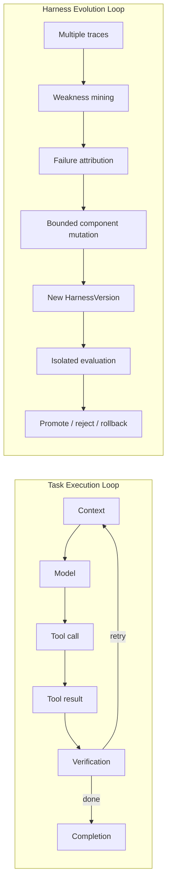

# Architecture

The runtime is organized as six ownership layers. None delegates the core agent loop to another
coding-agent harness.

| Layer | Owned responsibilities |
| --- | --- |
| Agent Runtime Kernel | provider abstraction, context, model/tool loop, sessions, skills, memory, subagents |
| Harness Component Plane | versioned component graph, content identity, dependencies, provenance |
| Operations Control Plane | start, submit, observe, interrupt, resume, recover, validate, finalize |
| Evidence Plane | runtime events, receipts, artifacts, facts/inferences, append-only chains |
| Evolution Control Plane | weakness mining, attribution, bounded proposals, candidates, gates, decisions |
| Immutable Trust Plane | evaluator, splits, budgets, permissions, safety, model identity, audit, promotion policy |

## Separate lifecycle loops



Retry, recovery, reflection, memory update, component mutation, and harness evolution are distinct
events. Evolution requires a new immutable `HarnessVersion`, independent evaluation, and an auditable
decision.

## Lifecycle state machines

Session:

```text
created → initialized → running → waiting/blocked
blocked → recovering → running
running → validating → completed → retired
```

Harness version:

```text
draft → candidate → statically_validated → evaluating → canary → active → retired
                         └──────────────→ rejected
active/canary ─────────────────────────→ rolled_back
```

The state machines have separate records and transition guards. Session restart cannot modify a
harness-version lifecycle.

## Component mutation boundary

The MVP may mutate system prompts, context selection, memory retrieval, skills, workflow/routing
policy, tool descriptions, and subagent prompts. Evaluators, test splits, budgets, permissions,
safety, model identity, tool implementations, middleware, trace collectors, audit logs, promotion
policy, and optimizer code remain immutable.

## Public-development boundary

Published development artifacts are governed by `PublicExposurePolicy`. Direct tokens and graph
edges are matched by exposure ID, artifact ID, path, Git blob, content hash, alias, dependency,
wrapper, and provenance. A protocol-version change, Git history rewrite, or repository deletion
cannot clear exposure.

For the published snapshot and every transitive derivative:
`publicDevelopment=true`, `authorizedForResearchEvidence=false`, held-out/sealed/temporal/gate/final
eligibility is false, confirmatory use is false, and promotion authorization is false.

## Evaluator-vault precondition

Before any future private task can be admitted, the body-free contract requires a separate protocol
author, benchmark author, blinded reviewer, vault, evaluator, scorer, promoter, and audit identity.
Assignment, commitment, blinding, inclusion/rejection, vault seal, one-time unlock, evaluation
commitment, score commitment, and audit are distinct signed transitions. Denied accesses release no
fields and preserve state. One authoritative CAS journal reconstructs task state and access decisions;
a separate owner/epoch lease journal coordinates writers, while acquire/renew fences in the
authoritative journal make stale epochs lose the expected state head. State file sync, directory sync,
and exact-head verification precede every release. The current implementation uses synthetic metadata
only and does not create or evaluate a real task body.

The detailed contract is in
`docs/architecture/evaluator-vault-contract.md`; the remaining architecture and schemas are in
`docs/architecture/` and `schemas/`.

## Local conformance closure

`governance/trust-plane/conformance-manifest.json` is a protocol-author-signed, reference-only
closure over seven already reviewed domains: standalone runtime/Gate 2R, development process
separation, publication governance, independent authorship and vault admission, durable vault state,
eight-principal OS integration, and synthetic one-time custody. It does not copy an earlier result or
create a new evaluation.

The aggregate verifier resolves every reference from its pinned Git commit, checks the exact commit
tree and raw file hash, verifies ruling and claim-boundary locators, reconstructs both append-only
governance chains, and checks scoped protocol/component identities for contradictions. The manifest
separates implemented controls, locally tested controls, deferred controls, and unclaimed properties.
All provider, research-evidence, selection, promotion, deployment, and claim authorities remain
false.
