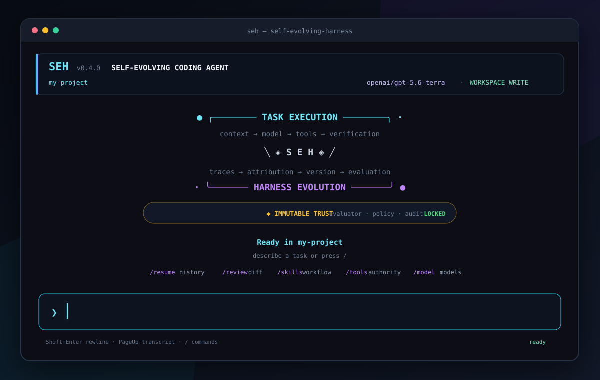
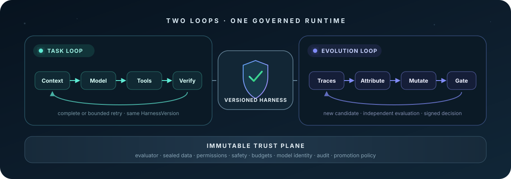

<p align="center">
  
</p>

<h1 align="center">SEH — Self-Evolving Harness</h1>

<p align="center">
  <strong>A standalone coding agent that owns the runtime—and evolves it under evidence.</strong><br />
  Code, tools, memory, sessions, verification, and governed harness evolution in one terminal product.
</p>

<p align="center">
  <a href="https://github.com/dsa04156/self-evolving-harness/actions/workflows/ci.yml"></a>
  
  
  
  
</p>

<p align="center">
  <a href="#install">Install</a> ·
  <a href="#the-terminal-is-the-product">Terminal UX</a> ·
  <a href="#what-seh-owns">Capabilities</a> ·
  <a href="#two-real-lifecycles">Evolution</a> ·
  <a href="docs/user-guide.md">CLI guide</a> ·
  <a href="ARCHITECTURE.md">Architecture</a>
</p>

## Install

SEH runs its own agent loop. It does not launch Codex CLI, Gajae-Code, OpenCode, or another harness behind the scenes.

```bash
npm install --global github:dsa04156/self-evolving-harness
```

Then open any repository:

```bash
cd your-project
seh
```

Requirements: Linux, Node.js 22+, Git, and Bubblewrap. Run `seh doctor` to check the machine and see the [provider setup guide](docs/user-guide.md#provider-setup) before the first real task.

Build from source instead:

```bash
git clone https://github.com/dsa04156/self-evolving-harness.git
cd self-evolving-harness
npm ci
npm run link:cli
seh
```

## The terminal is the product

<p align="center">
  
</p>

Starting `seh` takes over the terminal's alternate screen, like a modern coding-agent CLI. A fixed workspace header, scrollable transcript, activity line, command overlays, and multiline composer stay in one stable layout; exiting restores the original terminal contents. The home screen shows the selected model, current authority, verification configuration, and recent durable threads before the first prompt.

Type `/` and the command palette appears immediately:

- fuzzy command filtering as you type;
- `↑` / `↓` selection and `Tab` completion;
- command descriptions and argument hints in place;
- prompt history with arrow-key recall;
- a keyboard-driven session picker for `/resume`;
- explicit `/fork` lineage and a derived `/thread` view of turns and runtime items;
- a searchable `/model` registry spanning direct OpenAI, 250+ live tool-capable OpenRouter routes,
  installed local models, curated examples, and exact custom IDs;
- a second model-specific reasoning picker (`Low`, `Medium`, `High`, `Extra high`, then advanced
  `Max`) plus `/effort` and an OpenAI `/fast` toggle;
- a searchable `/skills` catalog whose selections become versioned model context;
- bounded child agents and no-network backend jobs with visible lifecycle and shared accounting;
- `Shift+Enter` multiline editing and native bracketed paste;
- `PageUp` / `PageDown` transcript navigation;
- Korean and wide-character-aware cursor positioning;
- `Ctrl-C` to clear input, `Ctrl-L` for home, and `Ctrl-D` to exit;
- a readable response panel with verification and usage evidence.

Common interactive commands:

| Command | Action |
| --- | --- |
| `/new` | Start a clean conversation thread |
| `/resume` | Open the session picker or resume by ID |
| `/fork` | Branch from a session while inheriting its exact HarnessVersion |
| `/thread` | Inspect the non-authoritative Thread / Turn / Item projection |
| `/sessions` | List recent durable sessions |
| `/status` | Show lifecycle, usage, and verification evidence |
| `/diff` | Inspect the sandboxed workspace diff |
| `/review` | Review current changes through a temporary read-only turn |
| `/tools` | Inspect the active model-callable runtime surface |
| `/skills` | Search and toggle reusable workflow skills |
| `/agent TASK` | Delegate an independent task to a reduced-authority child agent |
| `/job COMMAND` | Start and wait for a sandboxed backend command |
| `/agents` | Inspect descendant limits, inheritance, and cleanup behavior |
| `/harness` | Show the exact HarnessVersion and runtime snapshot pinned to the latest task |
| `/evolution` | Compare task traces and executed versions without mislabelling retries as evolution |
| `/context` | Show bounded thread and model context limits |
| `/model` | Search providers and 250+ tool-capable model routes |
| `/effort` | Select a reasoning level advertised by the active model |
| `/fast` | Toggle OpenAI priority processing on supported models |
| `/permissions` | Inspect the active authority profile |
| `/read-only` / `/write` | Change authority for following turns |
| `/memory` | Inspect persistent project memory |
| `/verify` | Show external verification commands |

Shell completion is built in too:

```bash
# bash
source <(seh completion bash)

# zsh
source <(seh completion zsh)

# fish
seh completion fish | source
```

New configurations allow four child-agent or backend-job starts per task. Existing configurations
preserve their prior budget; opt in or change the cap explicitly with
`seh config --max-descendants 4`.

## Use it

Interactive work:

```bash
seh                                      # open the home screen
seh "Fix the authentication regression"  # open with an initial task
seh continue                             # continue the latest thread
seh resume                               # choose a durable session
seh resume --last                        # resume the newest session
seh fork --last                          # branch from it with the same pinned harness
seh thread                               # inspect the derived event projection
seh harness                              # inspect the latest execution identity
seh evolution                            # inspect trace/version readiness
```

Automation and one-shot work:

```bash
seh run "Add focused tests for the parser"
seh run --skill tests "Add focused tests for the parser"
seh exec --read-only "Review this repository"
seh -p "Explain the current Git diff"

# Discover the exact non-interactive surface without opening the TUI
seh --json doctor
seh models --provider openai --search gpt-5.6
seh skills --read-only
seh tools --write
```

Common options can appear before or after a named command, so `seh --workspace ../repo status`
and `seh status --workspace ../repo` are equivalent. Commands that support `--json` emit only one
versioned JSON document; failures use the same `{ schemaVersion, ok, error }` envelope and never
include credential values.

Initialize explicit workspace policy when you want the model, write authority, and verifier recorded before the first task:

```bash
seh init --provider openai --model gpt-5.6-sol --effort high --fast --write --verify "npm test"
seh doctor
seh
```

Configuration, session evidence, and project memory live outside the target repository under `~/.local/state/self-evolving-harness/`. Provider secrets are read from the process environment and are never persisted in configuration, sessions, events, or memory.

## What SEH owns

This is an independent coding-agent runtime, not a controller around someone else's agent.

| Surface | Runtime ownership |
| --- | --- |
| Model | Provider contract, request loop, model identity, usage accounting |
| Context | System prompt, bounded history, memory, skills, tools, overflow policy |
| Tools | Guarded files, shell, Git, child-agent, and backend-job coordination |
| Sessions | Durable lineage, interrupt, resume, recovery, validation, retirement |
| Memory | Filesystem persistence with explicit namespace and authority |
| Workflow | Searchable skills, subagents, backend jobs, inherited budgets and cleanup |
| Permissions | Read-only/workspace-write modes and Bubblewrap process isolation |
| Evidence | Structured runtime events, receipts, artifacts, and append-only audit chains |
| Verification | External sandboxed commands and deterministic fake verifiers |
| Evolution | Attribution, bounded mutation, isolated evaluation, promotion, rejection, rollback |

The normal task path is fully owned by SEH:

```text
prompt → context → model → tool call → tool result → verifier → completion or bounded retry
```

### Why SEH does not fork Codex

SEH borrows product ideas—full-screen terminal composition, command discovery, model profiles,
session lineage, and Thread / Turn / Item terminology—but not Codex's execution backend. An
exact-commit code audit found that the Codex TUI is coupled to its app server, core runtime, login,
provider, tool, sandbox, and persistence surfaces. Forking it would turn SEH into a Codex-derived
runtime and invalidate the independent-harness contribution.

Instead, every product setting is now materialized into SEH's typed component registry. A session
commits the resulting manifest, behavior-closure hash, and runtime contract before provider
construction. Resume and fork inherit that exact version. The Thread / Turn / Item screen is derived
from SEH RuntimeEvents and is permanently marked `projection_only`; it cannot authorize execution or
evolution decisions. See [ADR-0007](docs/architecture/adr-0007-codex-patterns-not-runtime.md) and the
[exact-SHA reuse ledger](docs/research/codex-reuse-ledger.md).

## Two real lifecycles

Retrying a failed prompt is not self-evolution. SEH represents task execution and harness evolution as separate state machines.

<p align="center">
  
</p>

### Task execution loop

One pinned `HarnessVersion` solves one task through model calls, guarded tools, verification, and bounded recovery. Retrying, reflecting, resuming, or updating session memory stays inside this lifecycle.

### Harness evolution loop

Evidence from multiple executions is mined for recurring weaknesses. A proposal must identify a bounded component, create a new content-addressed `HarnessVersion`, evaluate it independently in an isolated Git worktree, and record one explicit decision:

```text
traces → weakness mining → attribution → bounded mutation → candidate
       → held-in + held-out evaluation → promote / reject / rollback
```

The proposer cannot mutate the evaluator, safety and permission policy, benchmark split, budget, model identity, audit log, promotion policy, tool implementation, middleware, or optimizer code in the MVP.

## Six planes, one trust boundary

```text
┌──────────────────────────────────────────────────────────────────┐
│ 1  Agent Runtime Kernel       model · context · tools · sessions │
│ 2  Harness Component Plane    versioned component graph          │
│ 3  Operations Control Plane   start · observe · recover · retire │
│ 4  Evidence Plane             events · receipts · artifacts      │
│ 5  Evolution Control Plane    mine · attribute · mutate · gate   │
├──────────────────────────────────────────────────────────────────┤
│ 6  Immutable Trust Plane      evaluator · policy · budget · audit│
└──────────────────────────────────────────────────────────────────┘
```

The evaluator runs as a separate process with reduced authority. Candidate worktrees cannot read sealed data or alter immutable components. Qualification and deployment are separate: approving a candidate does not silently move the active pointer.

Read [ARCHITECTURE.md](ARCHITECTURE.md), the [threat model](SECURITY.md), and the [rendered diagram set](docs/diagrams/README.md) for the full contracts.

## Current status

SEH is a working research alpha, not a finished empirical claim.

| Area | Status |
| --- | --- |
| User coding-agent CLI | Implemented: home, palette, model profiles, searchable skills, child agents/jobs, resume/fork/thread lineage, memory, permissions, verification |
| Deterministic standalone runtime | Implemented and covered by fake-model/fake-tool tests |
| Versioned harness registry | Implemented and wired to product execution/session pins |
| Worktree-isolated bounded mutation | Implemented prototype |
| External evaluator and audit trail | Implemented deterministic boundary |
| Fair B0–B6 real-provider experiment | Not run |
| General self-improvement claim | Not claimed |

Run the deterministic release gate:

```bash
npm run verify:release
```

It type-checks and builds the runtime, runs the deterministic suite, compiles every frozen JSON Schema, executes the no-network managed demo, and verifies development, publication, historical-publication, and trust-plane evidence.

## Repository map

```text
src/product/       terminal UX, product config, sessions, coding-agent assembly
src/runtime/       provider loop, context, tools, memory, skills, workflow
src/harness/       component graph and version registry
src/operations/    session lifecycle and recovery
src/evidence/      runtime events, receipts, artifacts, audit records
src/evolution/     attribution, proposals, candidates, evaluation, promotion
src/trust/         immutable authorities and evaluator boundary
schemas/           cross-process JSON contracts
evaluator/         separately launched evaluator processes
benchmarks/        deterministic fault fixtures and frozen split metadata
test/              deterministic, adversarial, recovery, and terminal UX tests
```

## Documentation

- [CLI user guide](docs/user-guide.md)
- [Architecture](ARCHITECTURE.md)
- [Security and trust boundary](SECURITY.md)
- [Reproducibility](REPRODUCIBILITY.md)
- [Claims and non-goals](CLAIMS.md)
- [Exact-SHA prior-art ledger](docs/research/source-ledger.md)
- [Codex CLI and Gajae-Code UX code-path study](docs/research/cli-ux-reference.md)
- [Evaluation plan and current evidence](docs/evaluation/final-report.md)
- [Limitations](LIMITATIONS.md) and [negative results](NEGATIVE_RESULTS.md)

## Claim discipline

The current repository supports an architecture and deterministic systems-artifact claim. It does not claim that one improved score, a retry, a prompt rewrite, or an unsealed development run demonstrates general self-improvement. The proposed attribution-guided bounded mutation must still beat static, retry, sampling, reflection, prompt-only, and free-form rewrite baselines under matched budgets on sealed held-out work.

### Permanent public-development boundary

Every artifact in this public development snapshot—and every copy, alias, dependency, wrapper, or
provenance-derived descendant—remains `publicDevelopment=true` and
`authorizedForResearchEvidence=false`. Renaming it, changing the protocol ID, rewriting Git history,
or deleting the repository cannot make it sealed, held-out, confirmatory, or promotable evidence.
