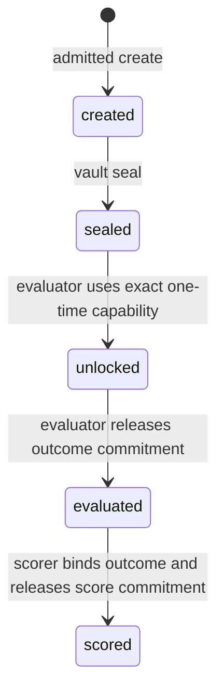
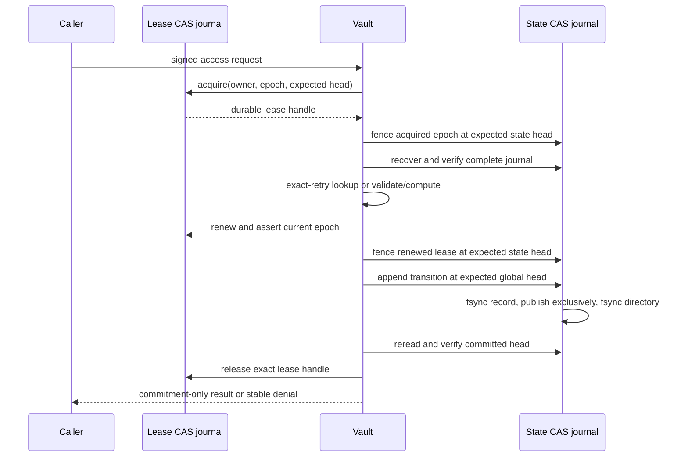

# Evaluator Vault and Independent Authorship Contract

Status: local deterministic contract prototype; synthetic metadata only; no benchmark body exists

## Purpose and boundary

This contract separates benchmark authorship, task custody, evaluation, scoring, promotion, audit, and
protocol authorship. It does not create or expose a real `D_gate`, final, temporal, withheld-public, or
Terminal-Bench task. The executable prototype transports only opaque handles, SHA-256 commitments,
role identities, decisions, and audit metadata.

The contract is not an evaluator implementation and is not a research run. It establishes the
precondition under which a future evaluator may receive a one-time capability without giving the
proposer, author, scorer, promoter, or protocol author a task body or unauthorized result.

## Frozen principals

Every principal has a distinct principal ID, instance ID, identity digest, key ID, and Ed25519 public
key. Private keys are absent from the contract.

| Principal | Contract role | May do | Cannot receive through this contract |
|---|---|---|---|
| benchmark author | `benchmark_author` | create an authorship commitment | run results, vault private state, promotion state |
| blinded reviewer | `benchmark_reviewer` | include or reject a blinded commitment | author identity, raw handle, task/verifier body, labels, paths |
| vault | `vault` | blind, finalize reviewer decision, seal, enumerate commitments, issue unlock capability | candidate identity, provider credentials, promotion state |
| evaluator | `evaluator` | consume one exact unlock capability and emit an outcome commitment | author identity, score, promotion state |
| scorer | `scorer` | score the exact released outcome commitment | task body, author identity, candidate registry |
| promoter | `promoter` | receive a score commitment only | task handle/body, author identity, vault state |
| audit store | `audit_store` | verify the signed access chain | vault private contents, provider credentials, candidate worktree |
| protocol author | `protocol_author` | freeze the contract and assign authorship work | task results, vault private contents, promotion state |

`schemas/evaluator-vault-contract.schema.json` freezes the exact role-specific mount declarations and
action matrix. These declarations are a contract for later OS enforcement; this round does not claim
that the new eight-role mount table was exercised in separate OS sandboxes.

## Independent authorship lifecycle

```mermaid
stateDiagram-v2
    [*] --> assigned: protocol author assigns
    assigned --> committed: author signs content/verifier commitments
    committed --> under_blinded_review: vault creates identity-free review projection
    under_blinded_review --> included: reviewer signs include; vault finalizes
    under_blinded_review --> rejected: reviewer signs reject; vault finalizes
```



The assignment contains no content or verifier commitment. The author commit contains only SHA-256
commitments, inclusion-rule and collection-window hashes, and a contamination declaration. It sets
`bodyPresent`, `verifierLogicPresent`, `labelsPresent`, and `pathsPresent` to `false`.

The vault's review projection replaces the raw opaque handle with its SHA-256 commitment and excludes
the author identity. The reviewer signs a separate identity-free `include` or `reject` decision; a
rejection must bind a reason commitment. The vault verifies and embeds that decision before finalizing
the full transition, so the reviewer never receives the transition containing the raw handle or author
principal. Every transition binds the prior transition hash, contract hash, protocol ID, workflow ID,
exact task handle, actor identity, and role key in an append-only log.

An included transition can be projected into a vault admission pair:

```text
(sha256(opaque task handle), included authorship record hash)
```

The vault accepts `create` only when that pair is in its private admission set. This prevents a
benchmark-author key from inventing an unreviewed task commitment at the vault boundary.

## Historical contamination check

Each author commit is checked against the immutable historical public-exposure ledger
`sha256:52d22b10543d23fa0f7d268de029514c7ab8e62a3ab39277ade4d0c37da1e035`.

The check applies every restricted use class, including sealed/held-out, temporal, gate/final,
confirmatory, candidate selection, promotion, and research evidence. It traverses direct content
hashes, Git object IDs, aliases, dependencies, wrappers, and provenance references. A protocol rename,
copy, wrapper, new path, deleted Git ref, or history rewrite does not clear the contamination.

## Vault task lifecycle



`enumerate` releases only sorted handle commitments. The vault-signed unlock capability is bound to:

- the exact protocol, contract, opaque handle, included-authorship record hash;
- the one frozen evaluator identity and key;
- action `unlock`, single-use semantics, issuance/expiry times, and nonce; and
- an explicit statement that this body-free prototype carries no task body.

`evaluate` can follow only `unlocked`. `score` can follow only `evaluated` and must present the exact
evaluation commitment released by the evaluator. The resulting score commitment is derived from the
protocol, contract, handle commitment, evaluation commitment, and signed scorer request. No score is
returned to the evaluator, and no handle is returned to the promoter.

## Authoritative state, access decision, and one-way release

The authoritative vault journal is a filesystem CAS chain of vault-signed
`VaultStateTransitionRecord` values. Each value embeds the accepted `VaultAccessRecord`, so access
evidence and task-state authority cannot diverge. A state transition binds:

- protocol and contract IDs;
- the request, opaque-handle, authorship, actor-identity, actor-key, input, capability, and result
  commitments;
- the previous global vault-journal head and previous per-task state-record hash;
- the current durable writer-lease owner commitment, epoch, lease record, and lease-journal head;
- state before/after plus whether the record is a task-state successor; and
- request occurrence time, operational commit time, vault key, record hash, and signature.

Every first-seen allowed or denied request produces one embedded vault-signed `VaultAccessRecord`. The
record contains:

- claimed and independently recomputed request hashes;
- requested and frozen protocol/contract identities;
- claimed role plus request/actor/key commitments, sender sequence, and a nonce commitment;
- only a hash of the opaque task handle;
- state before/after, decision, stable failure code, and release class; and
- four explicit `false` flags for task body, raw handle, author identity, and candidate identity.

Untrusted request IDs and key identifiers are never copied into the ledger; only their commitments are
stored, preventing a denied request from laundering an opaque handle through an audit field. Denied
requests have `releaseClass=none`, zero field names, and identical before/after state. Accepted sequence,
nonce, capability use, evaluation/score commitment, and task state are reconstructed from the durable
journal. An exact byte-identical retry returns the already committed result or denial without appending
a second transition; a fresh request attempting the obsolete state is denied and recorded.

Release projections are one-way and commitment-only:

| Action | Release recipient | Released fields |
|---|---|---|
| create / seal | none | none |
| enumerate | vault | opaque handle commitments |
| unlock | evaluator | capability hash |
| evaluate | scorer | evaluation commitment |
| score | promoter | score commitment |
| audit | audit store | append-only chain head |

## Cross-process serialization and commit-before-release

The vault has two durable logs with different authority:

- the state journal is the only authoritative task-state/access-decision projection; and
- the lease journal coordinates writers but cannot itself change task state.

The lease journal uses exclusive expected-head CAS records with an owner commitment and monotonically
increasing epoch. `acquire`, `renew`, and `release` bind the prior lease record and prior lease-journal
head. An unexpired writer blocks a second writer. After expiry, a new owner may acquire the next epoch;
the old handle can no longer renew, release, or authorize a transition. Every recovered state
transition must reference an existing active lease record and must have been committed within that
lease's validity interval.

Acquisition alone does not authorize a task write. The owner must append a signed
`VaultWriterFenceRecord` into the authoritative state journal at the expected global head. Renewal is
fenced again, and a task transition must immediately extend that exact fence with matching owner,
epoch, lease-record, and lease-journal commitments. Once a later epoch fence is published, an older
writer's expected state head is obsolete and its append loses CAS even if the old process resumes.



No release is returned before the state record is published, file-synchronized, directory-synchronized,
and reread as the exact head. A losing expected-head writer receives `CONFLICT`; the implementation does
not silently rebase a stale transition.

Recovery behavior is fixed:

| Failure boundary | Durable state after restart | Retry behavior |
|---|---|---|
| before append | no new transition | execute once after abandoned lease expiry |
| during temporary-file append | temporary file ignored; no authoritative transition | execute once |
| after exclusive publish, before directory sync | published record recovered and directory synced | return exact committed result |
| after record/directory sync, before head verification | committed record recovered | return exact committed result |
| after durable commit, before lease release | committed record retained; lease expires or is recovered | return exact committed result |
| after release, before caller acknowledgement | committed record and released lease retained | return exact committed result |

## Fail-closed cases exercised

The deterministic focused suite rejects and records:

- an action requested by the wrong role;
- a valid signature from a non-frozen key of the correct role;
- fresh repeated sender sequence/nonce and obsolete state, including after vault re-instantiation;
- a capability substituted onto another opaque task;
- evaluation before unlock and scoring before evaluation;
- a request bound to another protocol;
- capability issue before sealing; and
- a modified signed access record.

It also exercises two actual Node processes contending for one lease, a killed holder followed by
next-epoch recovery, two separate vault processes racing an unlock and a third observing the committed
successor, stale-handle rejection, two in-process vault instances racing an unlock, obsolete CAS heads,
restart rejection of fresh second unlock/evaluate/score requests, scoring from merely unlocked state,
and injected crashes at every commit/release boundary. All denials preserve task state and release no
fields.

## Schemas and implementation

- `schemas/evaluator-vault-contract.schema.json`
- `schemas/independent-authorship-transition.schema.json`
- `schemas/blinded-authorship-review.schema.json`
- `schemas/blinded-authorship-decision.schema.json`
- `schemas/opaque-task-capability.schema.json`
- `schemas/vault-access-request.schema.json`
- `schemas/vault-access-record.schema.json`
- `schemas/vault-state-transition.schema.json`
- `schemas/vault-writer-fence.schema.json`
- `schemas/vault-writer-lease.schema.json`
- `src/storage/cas-append-only-log.ts`
- `src/trust/evaluator-vault-contract.ts`
- `src/trust/independent-authorship.ts`
- `src/trust/evaluator-vault.ts`
- `src/trust/vault-writer-lease.ts`
- `test/evaluator-vault-contract.test.ts`
- `test/fixtures/vault-lease-worker.ts`
- `test/fixtures/vault-transition-worker.ts`

## Residual limits

- This round proves a deterministic contract and signed metadata flow, not confidentiality of a real
  task body.
- The role mount table is frozen but not newly exercised under eight separate OS identities in this
  round.
- The durable journal reconstructs body-free task state and recovery metadata. Real encrypted body
  custody remains future work.
- The two-process tests exercise both lease contention and body-free vault transitions; a full
  evaluator/task execution under separate OS identities and mounts remains unexercised in this
  correction.
- Lease expiry depends on the trusted host clock. Availability during a live-but-stalled writer and
  malicious clock changes remain host/operations risks; CAS still prevents two records from occupying
  the same expected global head.
- The local host, kernel, filesystem, bootstrapping administrator, protocol-author key, vault key, and
  schema implementation remain trusted.
- No provider, model, proposer, benchmark scheduler, evaluator process, scorer process, promotion, or
  deployment was run.
- None of these artifacts may support C-H1–C-H4 or any self-improvement/performance claim.
